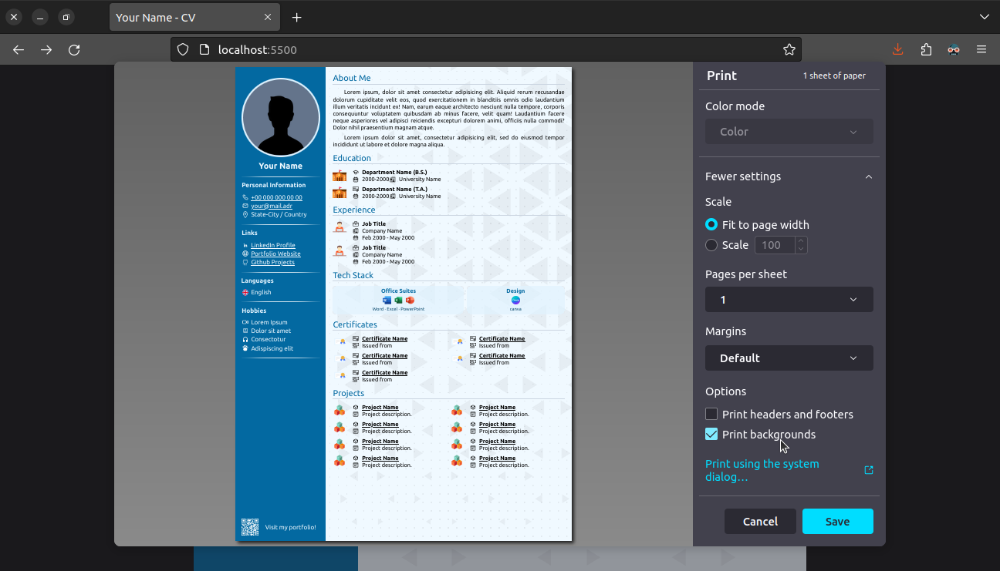

# Create Your Own CV

To create your own CV, fill the variables.pug file. After that you need to install pug-cli. You will need npm and node.js for this.

```sh
npm install -g pug-cli

# if root privileges needed, add sudo or doas etc.
sudo npm install -g pug-cli
```

After that run pug with command below:

```sh
npx pug index.pug -P

# If you will make more difference add --watch parameter.
npx pug index.pug -P --watch
```

Then you need to process tailwindcss. To install tailwindcss run the command below:

```sh
npm install -g tailwindcss

# if root privileges needed, add sudo or doas etc.
sudo npm install -g tailwindcss
```

Now you are able to process style file:

```sh
npx tailwindcss -i index.css -o style.css

# If you will make more difference add --watch parameter.
npx tailwindcss -i index.css -o style.css --watch
```

Finally you would be able to view the portfolio. Open the index.html file that has just created.

You will see an html page. The CSS file is prepared in such a way that it can print the page as a pdf file. Just press <kbd>Ctrl</kbd> + <kbd>P</kbd>

Now you must select the "print backgrounds" option as seen on image.



Then save the file and have a great, new CV.